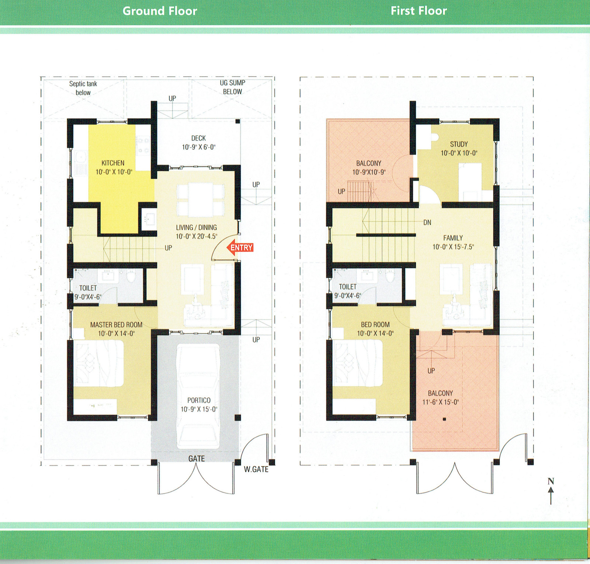

---
title       : Gokul Gardens
subtitle    : Mathampalayam
author      : Good living at a Budget
job         : 
logo        : Gokul gardens without background.png
biglogo     : [Krishna.png]
framework   : io2012        # {io2012, html5slides, shower, dzslides, ...}
highlighter : highlight.js  # {highlight.js, prettify, highlight}
hitheme     : tomorrow       # 
widgets     : []            # {mathjax, quiz, bootstrap}
mode        : selfcontained # {selfcontained,standalone, draft}
knit        : slidify::knit2slides
--- 

## Gokul Gardens

>* Gokul Gardens is a DTCP approved layout located on the outskirts of Coimbatore. With over a 100 plots, the layout caters to good quality living at a reasonable value.

>* The well-planned layout has wide roads, rainwater harvesting, overhead water storage tank, flowering trees and various parks across the layout. Located close to Mathampalayam, it is surrounded with 12 educational institutions and hospitals within 5 km.

--- &custbg bg:"./assets/img/IMG_8096.jpg"

## Gokul Gardens - Plots

>* Our plots are fully approved residential plots which are priced affordably and are of 1.5 cents to 6 cents. Each plot is less than 50 metres away from the park which is covered with flowering trees and shrubs. Every plot has a beautiful view of the Nilgiris range and the surrounding hillocks.

---  &custbg bg:"./assets/img/IMG_8274.jpg"

## Gokul Gardens - Homes

>* 2 homes built at Gokul Gardens
>* Both homes built within 3.5 cents of land
>* Serve as model homes for Gokul Gardens

---  &custbg bg:"./assets/img/Sketches/Eco-friendly-cottage-HIG.jpg"

## Plot 15

---  &custbg bg:"./assets/img/IMG_8187-copy.jpg"

## Gokul Gardens - 15

>* The 3 bedroom home is built on 3.5 cents of land. It serves as a model of home that will come up within the layout in the near future. 
>* The home is semi-furnished and has all the amenities that will be true to good living at a budget.
>* The home in Gokul Gardens is supported by 2 sumps of 2,000 litres each. The kitchen is fully furnished with granite tops and modular fittings. 
>* A large portico and open spaces allows 1 cars and two-wheelers to be parked. A nice sitout on the 1st floor looks into the Western Ghats in the distance.
>* Eco-friendly home which is made up of German technology bricks for state of the art insulation

---  &custbg bg:"./assets/img/IMG_8258-copy.jpg"

## Gokul Gardens - 15

>* *Floor Plan of Plot 15*
>* 

---  &custbg bg:"./assets/img/Sketches/Eco-friendly-cottage-HIG.jpg"

## Gokul Gardens - 15 Factsheet

|Property | Plot 15|
|-----|-----|
|Type of Property | Individual House/Villa|
|BHK | 2 BHK|
|Google Maps | https://www.google.co.in/maps/@11.2090587,76.9842009,185m/data=!3m1!1e3|
|Built Up area | 2455 sq. ft.|
|Total Uncovered | 607.91|
|Carpet Area | 1798.06 sq.ft|
|Plot Size | 1500 sq.ft.|
|Flooring | Vitrified Tiles|
|Roofing | Mangalore tiled roofing with "Poo wood" for insulation|
|Balcony | Yes|
|Plinth | Section walls 8" and partition walls 4"|
|Brick Quality  | German Tech Outdoor Pholotherm chamber bricks for better insulation|

---  &custbg bg:"./assets/img/Sketches/Eco-friendly-cottage-HIG.jpg"

## Gokul Gardens - 15 Factsheet

|Property | Plot 15|
|-----|-----|
|Corner Plot? | No|
|Electrical Fittings | Havells electrical equipment|
|Light Fittings | Havells|
|Plumbing Fittings | UPVC pipes / Sanitary fittings of Tera brand|
|Feng Shui / Vaastu Compliant; | Yes|
|Reserved Parking; | Yes, within compound|
|Society | Eventually an Association will be formed.|
|Visitor Parking; |  On Avenue road abetting the house.|
|Underground Water Storage; | Sump of 5,500 litres [4,500 litres - bore water 1,000 litres - |drinking water]
| Overhead Tank = | 5000 litres  [1000 litres corporation tank, 4000 litre brick wall OHT]|
|Sewage Disposal:  | Septic tank = 4,000 litres , Soak pit = around 1,000 litres capacity|
|Rain Water Harvesting |  Provision|

---  &custbg bg:"./assets/img/Sketches/Compact-Contemporary-HIG.jpg"

## Gokul Gardens - 28

---  &custbg bg:"./assets/img/Plot28-exterior-001.jpg"

## Gokul Gardens - 28

>* First home built in Gokul Gardens, also built on 3.5 cents with a private car porch and 2800 sq.ft.
>* Home enjoys views of the Western Ghats
>* 3 bedroom home and has a large living / dining room
>* A large balcony creates ambiance and open spaces for the home which can also be used as a potted garden and evening sit out.

---  &custbg bg:"./assets/img/IMG_8197.jpg"

## Gokul Gardens - 28

>* *Floor Plan of Plot 28*
>* 

---  &custbg bg:"./assets/img/Sketches/Eco-friendly-cottage-HIG.jpg"

## Gokul Gardens - 28 Factsheet

|Property | Plot 28|
|-----|-----|
|Type of Property|Individual House/Villa|
|BHK|3 BHK|
|Google Maps|https://www.google.co.in/maps/@11.2097742,76.9839955,159m/data=!3m1!1e3?hl=en|
|Built Up area|2891.15 sq.ft|
|Total Uncovered|948.06|
|Carpet Area|2049.35 sq.ft|
|Plot Size|1525 sq.ft. (3.5 Cents )|
|Flooring|Tiles|
|Roofing|RCC|
|Balcony|Yes|
|Plinth|Main walls 9",  partitions 4.5"|
|Brick Quality |Chamber bricks|

---  &custbg bg:"./assets/img/Sketches/Eco-friendly-cottage-HIG.jpg"

## Gokul Gardens - 28 Factsheet

|Property | Plot 28|
|-----|-----|
|Corner Plot?|No|
|Electrical Fittings|Havells electrical equipment|
|Light Fittings|Havells|
|Plumbing Fittings|UPVC pipes / Sanitary fittings by Hindware|
|Feng Shui / Vaastu Compliant;|Yes|
|Reserved Parking;|Yes for 1 car and 1 bike with compounding|
|Society|Eventually an Association will be formed.|
|Visitor Parking;|On Avenue road abetting the house.|
Underground Water Storage; | Sump of 5,500 litres [4,500 litres - bore water 1,000 litres |-|6,200 litres[4,000 for bore, 2,200 for drinking]|
|Overhead Tank =|4,000 litres [1,000 for drinking water]|
|Sewage Disposal: |4,800 litres|
|Rain Water Harvesting|Yes|

---  &custbg bg:"./assets/img/IMG_8152.jpg"

## Benefits of being at Gokul Gardens

Some of the benefits the layout has to offer are:

>* 1,50,000 litre overhead water tank
>* Rain water harvesting done throughout the layout to charge wells
>* Avenue trees along all roads with drip irrigation to support them for years
>* Fully tarred 40 feet main road with 23 & 30 feet avenue roads
>* Street Lighting & domestic EB connections available within layout
>* 50,000 sq.ft of park with Basketball, Volleyball and Badminton courts. The area with 3 zones catering to seniors, active youth and kids
>* DTCP Approved Plan along with Clear Title Deeds
>* 10-15 mins from Karamadai & Periyanaickenpalayam Stations
>* 2 NH highways within 5 mins drive

---  &custbg bg:"./assets/img/LocationMap.jpg"

## Location

---  &custbg bg:"./assets/img/LocationMap.jpg"

## Location (cont.)

* 2.25 kms off from NH 67 Coimbatore - Mettupalayam (i.e. 5 minutes driving time)
* 8 kms from NH. 209 Coimbatore - Sathy (approx 20 min driving time)

>* both these highways are playing host to number of educational & business establishments

>* Saravanampatti (20 minutes driving time), located on the NH 209 is a hot spot in terms of real overall activity

---  &custbg bg:"./assets/img/LocationMap.jpg"

## Surroundings

### Education

Mathampalayam and its vicinity are now home to number of schools and colleges

>* School, Vidya Vikas CBSE School
>* Christ The King International School
>* Christ The King Engineering College
>* KTVR Engineering College

There are atleast 12 educational institutions from with in 5 minutes to 25 minutes driving time from this place

---  &custbg bg:"./assets/img/LocationMap.jpg"

## Surroundings

### Public places and amenities

* A number of Temples and Churches are within short distance

>* Periyanaickenpalayam which is the next major town in this area is today home to Pricol Head Quarters and many ancillary units, number of hospitals, higher and school level educational institutions, service plus trade establishments. The fact that more than 10 banks including the banks like ICICI and a couple of departmental stores like Reliance Fresh have opened shops here are indicators of growth and development.

---  &custbg bg:"./assets/img/IMG_8394.jpg"
  
## Special Features of the Gokul Gardens
  
  >* Gokul Garden enjoys the view of large open farm lands on the eastern and northern side and the beautiful Nilgiris hills on the western side.

>* Rain Water Harvesting has been planned along the entire 1800 odd feet - 40 wide drive way. This will not only improve the ground water charge, but will also help our bore well. The entire layout is VASTU complaint.

---  &custbg bg:"./assets/img/IMG_8380web.jpg"

>* ## Planting Program

>* Avenue flowering trees like Gulmohar, Cordia, Yellow shower etc have been planted along the entire drive way and supported by drip irrigation. Besides this we have established a 10 height Cassurina hedge with about 3700 saplings to make up the western boundary. This hedge today has established itself as a 10 feet tall green screen.

---  &custbg bg:"./assets/img/IMG_8152.jpg"
## Roads
  
>* 40' wide main road with 23'& 30' supporting roads leading to the plots. The roads are metal topped and have gradual taper to avoid water stagnation.

---  &custbg bg:"./assets/img/IMG_8466.jpg"
## Park

>* The entire eastern boundary has a park spread over one acre. This will ensure oxygen supply to the whole layout rather than being confined to a few pockets.
Storm Water + waste water drain are built keeping rugged use in mind.

---  &custbg bg:"./assets/img/Picture1.png"

## Approval

>* Land has undergone conversion from agricultural to residential status by the Housing Department at Chennai and Local Planning Authority, Coimbatore.

