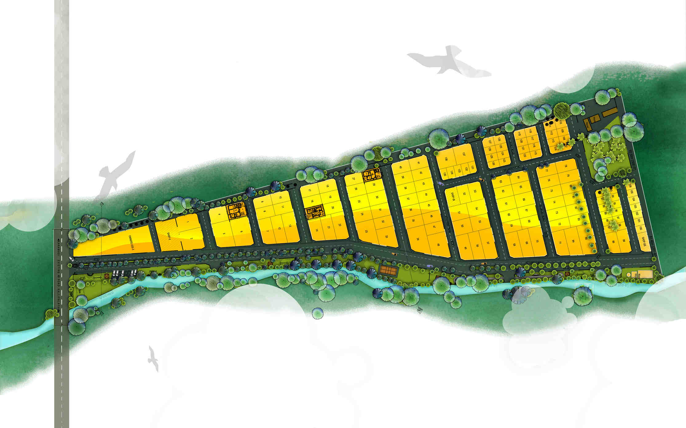

<!-- Limit image width and height -->

<!-- Center image on slide -->

## Gokul Gardens

Gokul Gardens is a DTCP approved layout located on the outskirts of Coimbatore. With over a 100 plots, the layout caters to good quality living at a reasonable value.

--- 

## Gokul Gardens - Layout

The well-planned layout has wide roads, rainwater harvesting, overhead water storage tank, flowering trees and various parks across the layout. Located close to Mathampalayam, it is surrounded with 12 educational institutions and hospitals within 5 km.

---

## Gokul Gardens - Plots

Our plots are fully approved residential plots which are priced affordably and are of between 1.5 cents to 6 cents. Each plot is surrounded with flowering trees and is less than 50 metres away from the park. Every plot has a beautiful view of the Nilgiris range and the surrounding hills.

---

## Gokul Gardens - Homes

---

## Gokul Gardens - 15

---

## Gokul Gardens - 28

---

## Benefits of being at Gokul Gardens

Some of the benefits the layout has to offer are:

>* 1,50,000 litre overhead water tank

>* Rain water harvesting done throughout the layout to charge wells

>* Avenue trees along all roads with drip irrigation to support them for years together

>* Fully tarred 40 feet main road with 23/30 feet approach roads

>* Street Lighting & domestic EB connections available within layout

>* 3 Parks spread over 50,000 sq.ft with Basketball, Volleyball and Badminton courts

>* DTCP Approved Plan along with Clear Title Deeds

>* 10 mins from Karamadai & Periyanaickenpalayam Stations

>* 2 NH highways within 5 mins drive

---

## Location

--- 

## Location (cont.)

* 2.25 kms off from NH 67 Coimbatore - Mettupalayam (i.e. 5 minutes driving time)
* 8 kms from NH. 209 Coimbatore - Sathy (aprox 20 min driving time)

>* both these highways are playing host to number of educational & business establishments

>* Saravanampatti (20 minutes driving time), located on the NH 209 is a hot spot in terms of real overall activity

---

## Surroundings

### Education

Mathampalayam and its vicinity are now home to number of schools and colleges

>* Vidhya Vikas Mat
>* School, Vidya Vikas CBSE School
>* Christ The King International School
>* Christ The King Engineering College
>* KTVR Engineering College

There are atleast 12 educational institutions from with in 5 minutes to 25 minutes driving time from this place

---

## Surroundings

### Public places and amenities

* A number of Temples and Churches are within short distance

>* Periyanaickenpalayam which is the next major town in this area is today home to Pricol Head Quarters and many ancillary units, number of hospitals, higher and school level educational institutions, service plus trade establishments. The fact that more than 10 banks including the banks like ICICI and a couple of departmental stores like Reliance Fresh have opened shops here are indicators of growth and development.

---
  
## Special Features of the Gokul Gardens
  
  >* Gokul Garden enjoys the view of large open farm lands on the eastern and northern side and the beautiful Nilgiris hills on the western side.

>* Avenue flowering trees like Gulmohar, Cordia, Yellow shower etc have been planted along the entire drive way and supported by drip irrigation. Besides this we have established a 10 height Cassurina hedge with about 3700 saplings to make up the western boundary. This hedge today has established itself as a 10 feet tall green screen.

>* Rain Water Harvesting has been planned along the entire 1800 odd feet - 40 wide drive way. This will not only improve the ground water charge, but will also help our bore well. The entire layout is VASTU complaint.

---
  
  ## Roads
  
  >* 40' wide main road with 23'& 30' supporting roads leading to the plots. The roads are metal topped and have gradual taper to avoid water stagnation.

## Park

>* The entire eastern boundary has a park spread over one acre. This will ensure oxygen supply to the whole layout rather than being confined to a few pockets.
Storm Water + waste water drain are built keeping rugged use in mind.

---

## Approval

>* Land has undergone conversion from agricultural to residential status by the Housing Department at Chennai and Local Planning Authority, Coimbatore.

